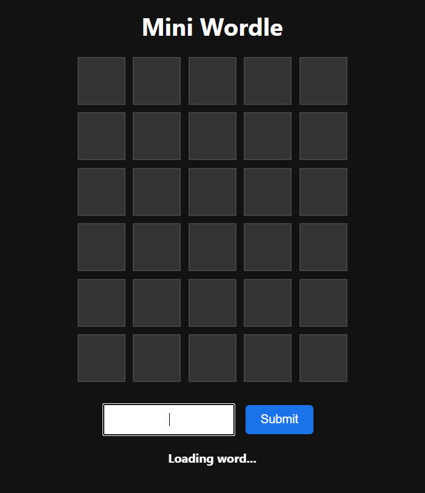
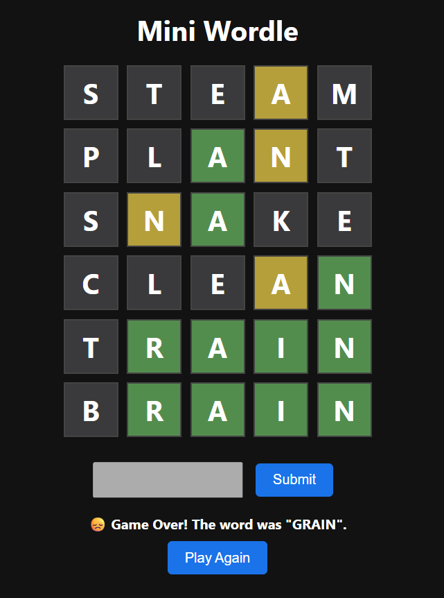
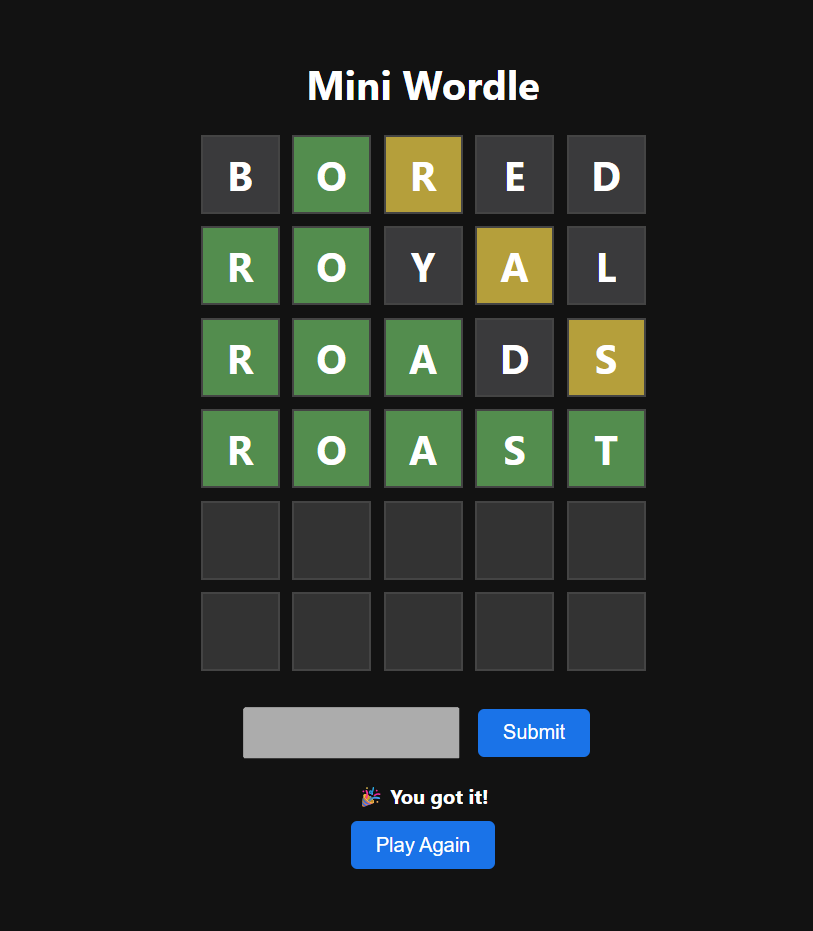

# 🎯 Mini Wordle Clone

A sleek, fully-functional Wordle clone built with just **HTML**, **CSS**, and **JavaScript** — no frameworks, no fluff, just pure frontend fire 🔥

This mini-project replicates the original game mechanics:
- You have **6 attempts** to guess a 5-letter word
- Feedback is given via tile colors:
  - 🟩 Correct letter in correct spot
  - 🟨 Correct letter in wrong spot
  - ⬛ Not in the word
- When the game ends, a **Play Again** button resets everything instantly!

---

## ✨ Features

- ✅ Clean UI and responsive layout
- 🎨 Wordle-style tile coloring (green/yellow/gray)
- 🔡 Keyboard input with `Enter` key support
- 🔁 Play Again button resets grid + word without reload
- 📦 Words loaded from a `JSON` file (`words.json`)

---

## 📂 Folder Structure

```
wordle/
├── index.html # Main HTML file
├── style.css # Styling and layout
├── app.js # Game logic and interactivity
├── README.md # Project documentation (this file)
├── data/
│ └── words.json # List of 5-letter words
└── screenshots/
│ └── gameplayGrid.png
│ └── success.png
│ └── wrong.png
```

---

## 📸 Screenshots

### 🔤 Gameplay Grid


### 🧠 Wrong Attempt Result


### 🎮 Successful Attempt Result
